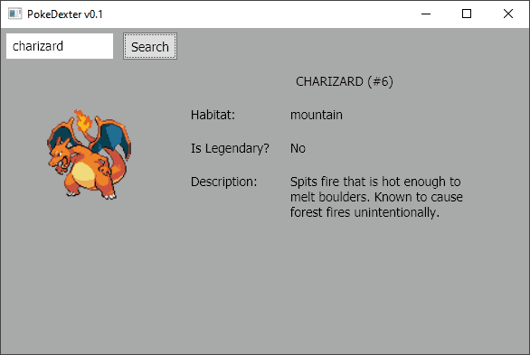

# PokeDexter

This standalone app returns some Pokemon lookup data.

### How To Use
1. On a Windows machine, [download the latest build](https://github.com/AntSkilton/PokeDexter/releases/download/release/PokeDexter_Release_0.1.7z), and unzip it. You may need 7Zip to unzip it.
2. Run `PokeDexterApp.exe`. If UAC pops up, select "More Info" and then "Run Anyway".
3. Enter any Pokemon name or it's number in the search bar to find some information about it.
---
These is search validation, and there's an easter egg if you fail an input on the first try.

If this was a for a production project, I would consider a different frontend implementation such as Blazor which doesn't require the user to download a new client everytime new client changes are made.